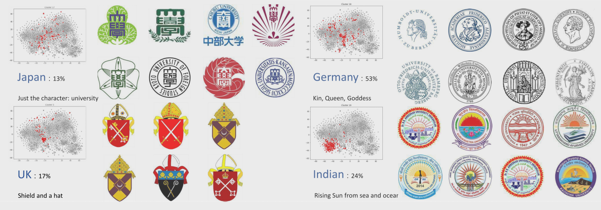
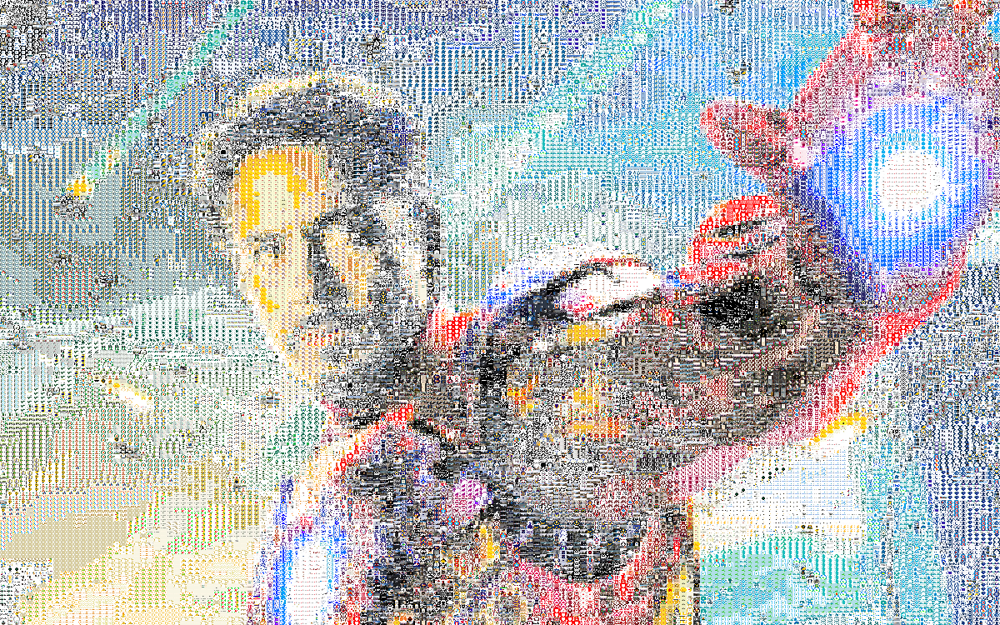

# University-Logo-Deep-Learning-Community-Detection

### About ourself

#### Team members:

1. [Langford-tang](https://github.com/Langford-tang)

2. [HUSTERGS](https://github.com/HUSTERGS)

3. [JacinthGDRGN](https://github.com/JacinthGDRGN)

4. [zmw1216](https://github.com/zmw1216)

### About the project

Basically we crawled most university logos from all over the world including 14 countries or cities and we feed the dataset into `autoencoder` neural network to get the high-dimension representation of the logos so we can calculate the **similarity** among them and get the distance matrix. And we first apply k-means and do community detection within every cluster, hoping to find something interesting and we did



> part of our interesting findings 

for more detailed information please look into the [poster](Team-Materials/poster.jpg) and [powerpoint](Team-Materials/CD.pptx) we made 

### Front end

```shell
cd Frontend
python -m http.server
```

open [http://0.0.0.0:8000](http://0.0.0.0:8000) in your browser

> Frontend folder is no longer maintained, please go to the backend folder which integrate the front end

### Back end

```shell
cd Backend
python ./server.py
# open 0.0.0.0 in your browser
# you can change the port and host in server.py
```

still under develop

### data

`data_200_pixel` all the data after manually select, format, crop, resize

`Cleaned.v2_format_jpeg.zip` all the raw data after manually select and format

### src

`*.py` related to neural network

`*.ipynb` 

1. `University_in_*` 

   crawl data using simulation browsing and Google Image Search Engine

2. `SelectData.ipynb`

   Select data from the whole dataset to do algorithms comparison

3. `China-Sample-3d.ipynb`

   Apply community detection algorithms to the distance matrix generated from neural network, and produce the `json` file to feed into the [`3d-force-graph`]('https://github.com/vasturiano/3d-force-graph') framework  

4. `mosaic.ipynb`

   > this is just a by-product

   generate mosaic picture with university logos we crawled using [`photomosaic`](https://github.com/danielballan/photomosaic) python package

   from 

   

   to 

   

   